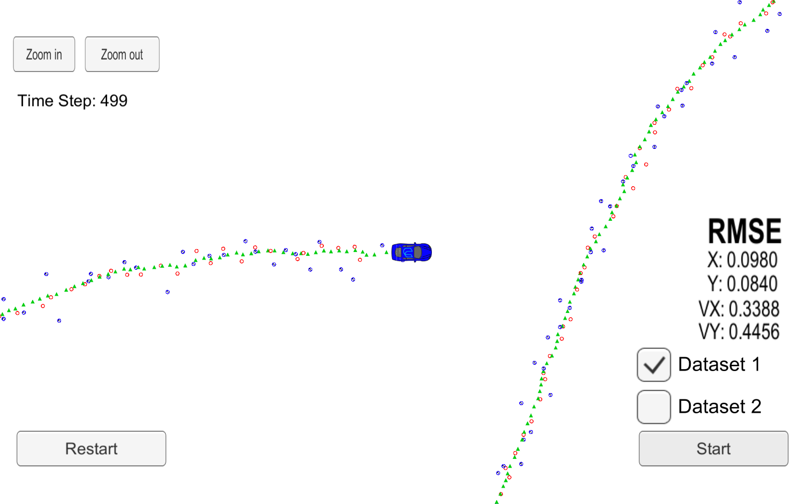
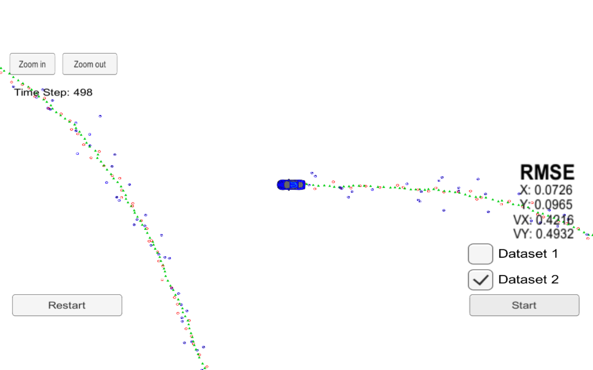
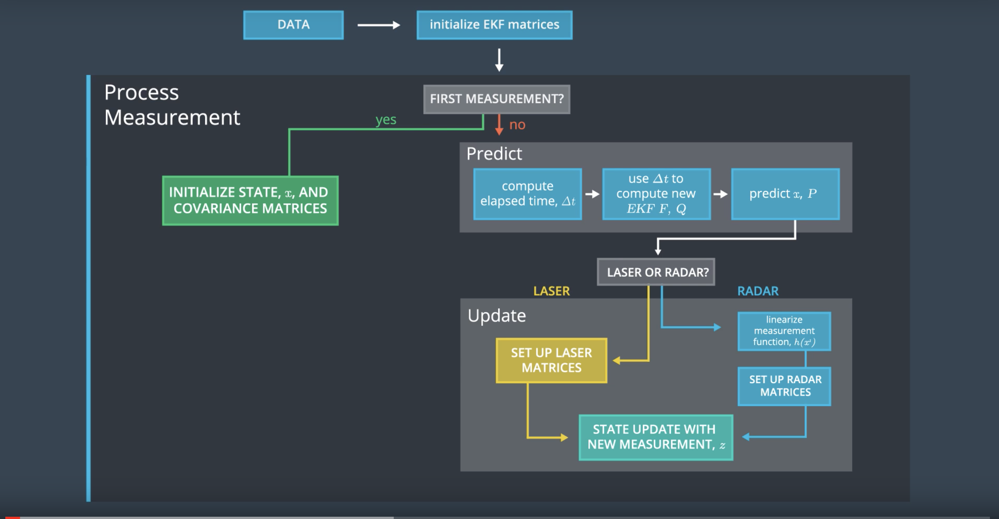

# Extended-Kalman-Filter

## The aim of the project

* Using computer vision for various taskes 
1 To utilize Extended-Kalman-Filter in the projcet and 
2 Use the sensors input data to find  lowest root mean square error 

###  File submited for review

File submission inculde all the required files that are necessary to quialy the project submission

1) FusionEKF.cpp
2) kalman_filter.cpp
3) tools.cpp
4) README.md

### Below is the images of the car with rmse 

##### This image is run on data set 1 and has 

--------------------------------------
| x       | y      |vx      | vy     | 
|---------|------- |--------|--------|
| .0980   | .0840  |.3388   |  .4456 | 

##### This image is run on data set 2 and has 
--------------------------------------
| x       | y      |vx      | vy     | 
|---------|------- |--------|--------|
| .0726   | .0965  |.4216   |  .4932 | 

### Description 

The proeject mainly takes the input from the sensor, mainly two types of sensors laidar and raidar, pip them into single channel in the hope the chances of error whould be lot less 

here is the image which display the actual working of the procedure 

